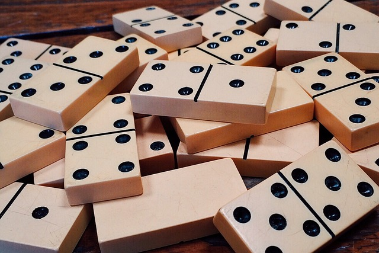

# Dominoes RL Project

In this project, the aim is to build RL agents for the sequential, cooperative game of 2v2 dominoes. The project is built on top of [Alan Wagner's](https://dominoes.readthedocs.io/en/latest/#board) Dominoes python library to create reinforecement learning agents that improve through self-play.

<p align="center">
  
</p>

# Installation

- 1. Fork repo
- 2. install `requirements.txt`
- 3. install in development mode:

```
pip install -e .
```

- 4. Try the files within `main` and `notebooks`!

```
python train_agent.py
```

---

# Project organization

The project is currently organized as follows:

- `/dominoes` includes the most important files; the game dynamics and the different players are stored here.
- `play_single_game.py` is an adapted CLI for this project. It allows for playing a single game with human player(s) and AI players.
- `/notebooks` contains jupyter notebooks that experiment with the library. For the moment, its not really working (I can't import the local library)

---

# TO-DOs

- [x] standardize agent's functioning in accordence to the pre-existing player's in the library (`__call__` doesn't execute the move, it just re-orders the priority queue)
- [x] visualize learning process.
- [x] run simulations of q_agent against itself, and other agents
- [ ] _fix `__call__` method for qlearner so that it avoids exploration during playtime._
- [ ] *gradually improve state representation (e.g. include the board and counts)*
- [ ] Integrate with/adapt to `open_spiel`; similar game already written.
- [ ] try cfr_agent

---

# Resources

In this section, relevant papers, resources, and other links are listed. The list is not exhaustive, and is meant to be a starting point for further research.

<font color="orange"><b>~</b></font>: To revisit

<font color="red"><b>N</b></font>: Not read

<font color="green"><b>Y</b></font>: Read

| Papers                                                                      | Category              | Reference                                                                                                                                                   | Status                               |
| --------------------------------------------------------------------------- | --------------------- | ----------------------------------------------------------------------------------------------------------------------------------------------------------- | ------------------------------------ |
| Connecting Optimal Ex-Ante Collusion in Teams to Extensive-Form Correlation | TMCor                 | [Farina et al. '21](https://proceedings.mlr.press/v139/farina21a.html)                                                                                      | <font color="orange"><b>~</b></font> |
| Multi-Agent Coordination in Adversarial Environments                        | MARL                  | [Cacciamani et al. '21](https://arxiv.org/pdf/2102.05026.pdf)                                                                                               | <font color="green"><b>Y</b></font>  |
| Steering No-Regret Learners to Optimal Equilibria                           | Equilibria\*          | [Zhang et al. '23](https://arxiv.org/abs/2306.05221)                                                                                                        | <font color="orange"><b>~</b></font> |
| Hindsight and Sequential Rationality of Correlated Play                     | Sequential Equilibria | [Morrill. et al '20](https://arxiv.org/abs/2012.05874)                                                                                                      | <font color="red"><b>N</b></font>    |
| Learning to Correlate in Multi-Player General-Sum Sequential Games          | Sequential Equilibria | [Celli et al. '19](https://arxiv.org/abs/1910.06228)                                                                                                        | <font color="orange"><b>~</b></font> |
| No-Regret Learning Dynamics for Extensive-Form Correlated Equilibrium       | Sequential Equilibria | [Celli et al. '20](https://arxiv.org/abs/2004.00603)                                                                                                        | <font color="green"><b>Y</b></font>  |
| Coarse Correlation in Extensive-Form Games                                  | Sequential Equlibria  | [Farina et al. '20](https://arxiv.org/abs/1908.09893)                                                                                                       | <font color="orange"><b>~</b></font> |
| Efficient Deviation Types and Learning for Hindsight Rationality            | EFR                   | [Morrill et al. '22](https://arxiv.org/pdf/2102.06973.pdf)                                                                                                  | <font color="red"><b>N</b></font>    |
| Counterfactual Regret Minimization (CFR)                                    | Tabular               | [Zinkevich et al '08](https://poker.cs.ualberta.ca/publications/NIPS07-cfr.pdf), [Neller &amp; Lanctot '13](http://modelai.gettysburg.edu/2013/cfr/cfr.pdf) | <font color="red"><b>N</b></font>    |
| Deep CFR                                                                    | MARL                  | [Brown et al. '18](https://arxiv.org/abs/1811.00164)                                                                                                        | <font color="red"><b>N</b></font>    |
| Mastering Stratego                                                          | Applications (MARL)   | [Perolat et al. '22](https://www.science.org/doi/full/10.1126/science.add4679)                                                                              | <font color="red"><b>N</b></font>    |
| Cicero: LLMs with strategic reasoning                                       | Applications          | [FAIR '22](https://www.science.org/doi/10.1126/science.ade9097)                                                                                             | <font color="orange"><b>~</b></font> |
| A Generalist Agent (Gato)                                                   | Applications          | [Reed et al. '22](https://arxiv.org/abs/2205.06175)                                                                                                         | <font color="green"><b>Y</b></font>  |
| Superhuman AI for multiplayer poker                                         | Applications (CFR)    | [Brown and Sandholm '19](https://www.science.org/doi/full/10.1126/science.aay2400)                                                                          | <font color="green"><b>Y</b></font>  |
| &alpha;-Rank                                                                | Eval. / Viz.          | [Omidhsafiei et al. '19](https://www.nature.com/articles/s41598-019-45619-9), [arXiv](https://arxiv.org/abs/1903.01373)                                     | <font color="red"><b>N</b></font>    |
| Nash Averaging                                                              | Eval. / Viz.          | [Balduzzi et al. '18](https://arxiv.org/abs/1806.02643)                                                                                                     | <font color="red"><b>N</b></font>    |
| Paper title                                                                 | theme                 | [authors](Link)                                                                                                                                             | <font color="orange"><b>~</b></font> |

**Other Resources**

- CMU 'Computational Game Solving' Course, Fall '23: [link](https://www.cs.cmu.edu/~sandholm/cs15-888F23/)
- CMU 'Computational Game Solving' Course, Fall '21: [link](https://www.cs.cmu.edu/~sandholm/cs15-888F21/)
- OpenSpiel
- DeepMind applying for MARL patents now?? [link](https://patentimages.storage.googleapis.com/9d/c6/3b/37b53db927a39b/US20230244936A1.pdf)

---

# From the original documentation

This library provides a `Game` class to represent a single dominoes game. It is built on top of `Domino`, `Hand`, and `Board` classes. Furthermore, you can string various games together and play up to a target score using the `Series` class.

Additionally, this package provides a command line interface to a dominoes series. Not only is it a great way to play a quick game, but it is also a comprehensive example of how to use this library's API.

## Usage Example

```
>>> import dominoes
>>> d = dominoes.Domino(6, 6)
>>> g = dominoes.Game.new(starting_domino=d)
>>> g
Board: [6|6]
Player 0's hand: [2|4][5|5][2|3][1|3][1|6][1|2]
Player 1's hand: [1|1][3|4][0|5][0|6][2|5][1|5][2|6]
Player 2's hand: [0|4][0|3][4|4][3|6][0|2][4|5][1|4]
Player 3's hand: [5|6][3|5][3|3][0|0][0|1][2|2][4|6]
Player 1's turn
>>> g.board
[6|6]
>>> g.hands
[[2|4][5|5][2|3][1|3][1|6][1|2], [1|1][3|4][0|5][0|6][2|5][1|5][2|6], [0|4][0|3][4|4][3|6][0|2][4|5][1|4], [5|6][3|5][3|3][0|0][0|1][2|2][4|6]]
>>> g.turn
1
>>> g.result
>>> g.valid_moves # True is for the left of the board, False is for the right
[([0|6], True), ([2|6], True)]
>>> g.make_move(*g.valid_moves[0])
>>> g.moves
[([6|6], True), ([0|6], True)]
>>> g
Board: [0|6][6|6]
Player 0's hand: [2|4][5|5][2|3][1|3][1|6][1|2]
Player 1's hand: [1|1][3|4][0|5][2|5][1|5][2|6]
Player 2's hand: [0|4][0|3][4|4][3|6][0|2][4|5][1|4]
Player 3's hand: [5|6][3|5][3|3][0|0][0|1][2|2][4|6]
Player 2's turn
>>> g.make_move(*g.valid_moves[0])
...
>>> g.make_move(*g.valid_moves[0])
Result(player=1, won=True, points=-32)
>>> g.result
Result(player=1, won=True, points=-32)
>>> g
Board: [2|6][6|3][3|4][4|1][1|1][1|6][6|4][4|5][5|2][2|4][4|0][0|6][6|6][6|5][5|0][0|3][3|5][5|5][5|1][1|0]
Player 0's hand: [2|3][1|3][1|2]
Player 1's hand:
Player 2's hand: [4|4][0|2]
Player 3's hand: [3|3][0|0][2|2]
Player 1 won and scored 32 points!
```

## Command Line Interface

```
$ dominoes
Welcome! Proceeding will clear all text from this terminal session. If you are OK with this, press enter to continue.
```

```
Up to how many points would you like to play: 100
Player settings:
0) Human
1) AI: random
2) AI: omniscient
Select a setting for player 0: 0
Select a setting for player 1: 1
Select a setting for player 2: 0
Select a setting for player 3: 1
Press enter to begin game 0.
```

```
Player 3 had the [6|6] and made the first move.
Board:
[6|6]
Player 0 has 7 dominoes in his/her hand.
Player 1 has 7 dominoes in his/her hand.
Player 2 has 7 dominoes in his/her hand.
Player 3 has 6 dominoes in his/her hand.
It is now player 0's turn. Press enter to continue.
```

```
Board:
[6|6]
Player 0's hand:
0) [3|6]
1) [4|4]
2) [0|1]
3) [2|6]
4) [1|1]
5) [2|5]
6) [3|3]
Choose which domino you would like to play: 3
Choose what end of the board you would like to play on (l or r): r
Press enter to end player 0's turn.
```

```
Board:
[6|6][6|2]
Player 1 (AI: random) chose to play [2|4] on the right end of the board.
Press enter to end player 1's turn.
```

```
Game over!
Board: [0|2][2|2][2|5][5|5][5|6][6|0][0|0][0|3][3|6][6|1][1|4][4|4][4|6][6|6][6|2][2|4][4|5][5|3][3|3][3|2][2|1][1|1][1|3][3|4]
Player 0's hand: [0|1]
Player 1's hand: [1|5][0|5]
Player 2's hand: [0|4]
Player 3's hand:
Player 3 won and scored 16 points!
The current state of the series:
Series to 100 points:
Team 0 has 0 points.
Team 1 has 16 points.
Press enter to begin game 1.
```

```
Game over!
Board: [5|3][3|3][3|6][6|5][5|5][5|0][0|4][4|3][3|1][1|6][6|2][2|5][5|4][4|6][6|0][0|3][3|2][2|0][0|0][0|1][1|4][4|2][2|2][2|1][1|1]
Player 0's hand: [1|5]
Player 1's hand: [4|4]
Player 2's hand:
Player 3's hand: [6|6]
Player 2 won and scored 26 points!
The current state of the series:
Series to 100 points:
Team 0 has 107 points.
Team 1 has 95 points.
Team 0 wins!
$
```

## Artificial Intelligence Players

Players are Python objects with a `__call__` method defined to accept a Game instance as the sole argument. Players return None, and leave the input Game unmodified, except for its valid_moves attribute. This value may be replaced with another tuple containing the same moves, but sorted in decreasing order of preference. Players may be applied one after another for easy composability.

---

---
